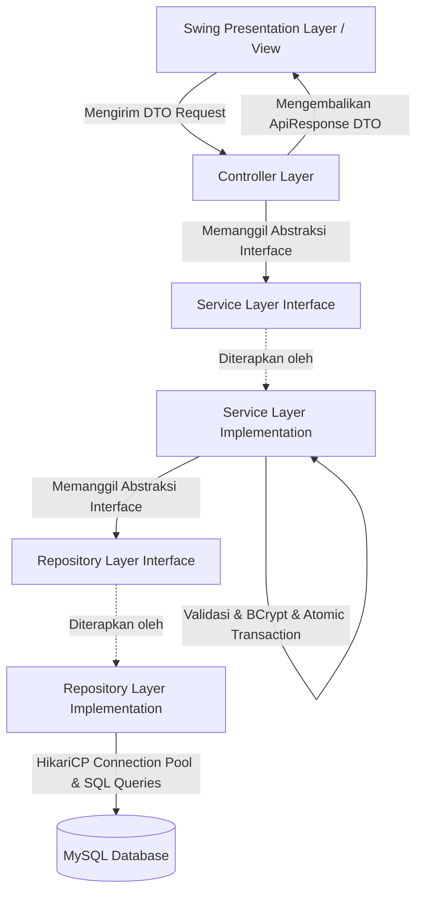

<div align="center">

# 🛒 Java Online Store & Point of Sales (POS)

**Enterprise-Grade Desktop Application built with Java 17, Clean Architecture, and SOLID Principles**

[](https://www.oracle.com/java/)
[](https://maven.apache.org/)
[](https://www.mysql.com/)
[](https://github.com/brettwooldridge/HikariCP)
[](https://github.com/patrickfav/bcrypt)
[](#arsitektur-sistem)

</div>

---

## 📖 Ringkasan Proyek (Overview)

**Java Online Store** adalah aplikasi Point of Sales (POS) dan e-commerce berbasis desktop yang dirancang dengan standar arsitektur perangkat lunak modern (**Clean Architecture & SOLID Principles**). 

Proyek ini telah direfaktorisasi dari arsitektur monolitik konvensional menjadi sistem berlapis berbasis **Interface Abstraction**, di mana setiap layer (Presentation, Controller, Service, Repository, Model, Config) memiliki tanggung jawab yang terisolasi (*Separation of Concerns*). Hal ini membuat codebase sangat modular, mudah diuji (*testable*), andal (*reliable*), dan siap untuk diekstensi menjadi RESTful Web API di masa mendatang.

---

## 🏛️ Arsitektur Sistem (Clean Architecture)

Aplikasi menerapkan pola arsitektur **Dependency Inversion** dan **Interface Segregation**:



### 🌟 Rekayasa Perangkat Lunak Utama (Key Highlights)

1. **Abstraksi Berbasis Interface (DIP & ISP)**:
   - Controller tidak terikat langsung dengan implementasi konkret, melainkan hanya bergantung pada interface `AuthService`, `ProductService`, dan `TransactionService`.
   - Service berkomunikasi dengan database melalui interface `UserRepository`, `ProductRepository`, `TransactionRepository`, dan `TransactionDetailRepository`.
2. **Manajemen Transaksi Atomik (ACID Compliant)**:
   - Proses checkout transaksi mengeksekusi validasi stok, pengurangan stok barang, pencatatan transaksi, dan penyimpanan item detail secara **atomik** dengan transaksi database (`setAutoCommit(false)`, `commit()`, `rollback()`) untuk mencegah inkonsistensi data.
3. **Koneksi Database Berkinerja Tinggi (HikariCP Pooling)**:
   - Menggantikan koneksi manual dengan `HikariDataSource` pool singleton yang mengelola siklus hidup koneksi secara efisien dan mencegah kebocoran resource (*connection leaks*) dengan standar `try-with-resources`.
4. **Keamanan Data & Enkripsi Password**:
   - Password pengguna di-hash menggunakan algoritma **BCrypt** dengan *work factor (salt rounds)* 12 sebelum disimpan ke basis data.
   - Penanganan autentikasi login aman terhadap serangan *User Enumeration*.
5. **Data Transfer Object (DTO) Pattern**:
   - Memisahkan data transport/payload (`model.dto.request` dan `model.dto.response`) dari domain entity database (`model.entity`), memastikan keamanan struktur database.
6. **Hierarki Custom Exception**:
   - Penanganan error terstruktur dengan exception spesifik: `ValidationException`, `UnauthorizedException`, `ResourceNotFoundException`, `InsufficientStockException`, dan `DatabaseException`.

---

## 📁 Struktur Proyek (Directory Structure)

```text
src/main/java/
│
├── config/
│   └── DatabaseConfig.java                  # Konfigurasi HikariCP Connection Pool & DataSource
│
├── controller/                              # Layer Pengendali (Request/Response Orchestrator)
│   ├── AuthController.java                  # Controller Registrasi & Login
│   ├── ProductController.java               # Controller Katalog & Stok Produk
│   └── TransactionController.java           # Controller Transaksi & Kasir
│
├── service/                                 # Layer Business Logic (Interface Abstraction)
│   ├── AuthService.java                     # Kontrak Service Autentikasi
│   ├── ProductService.java                  # Kontrak Service Manajemen Produk
│   ├── TransactionService.java              # Kontrak Service Checkout & Transaksi
│   └── impl/                                # Implementasi Logika Bisnis & Transaksi Atomik
│       ├── AuthServiceImpl.java
│       ├── ProductServiceImpl.java
│       └── TransactionServiceImpl.java
│
├── repository/                              # Data Access Layer / DAO (Interface Abstraction)
│   ├── UserRepository.java                  # Kontrak Akses Data User
│   ├── ProductRepository.java               # Kontrak Akses Data Produk & Stok
│   ├── TransactionRepository.java           # Kontrak Akses Data Transaksi
│   ├── TransactionDetailRepository.java     # Kontrak Akses Data Detail Transaksi
│   └── impl/                                # Implementasi JDBC Parameterized Query
│       ├── UserRepositoryImpl.java
│       ├── ProductRepositoryImpl.java
│       ├── TransactionRepositoryImpl.java
│       └── TransactionDetailRepositoryImpl.java
│
├── model/
│   ├── entity/                              # JPA / Domain Entities
│   │   ├── User.java
│   │   ├── Product.java
│   │   ├── Transaction.java
│   │   └── TransactionDetail.java
│   ├── dto/                                 # Data Transfer Objects (Payloads)
│   │   ├── request/                         # Request DTOs
│   │   │   ├── LoginRequest.java
│   │   │   ├── RegisterRequest.java
│   │   │   ├── ProductRequest.java
│   │   │   └── TransactionRequest.java
│   │   └── response/                        # Response DTOs
│   │       ├── ApiResponse.java             # Generic Wrapper (Success/Error format)
│   │       ├── LoginResponse.java
│   │       ├── UserResponse.java
│   │       ├── ProductResponse.java
│   │       ├── TransactionResponse.java
│   │       └── TransactionDetailResponse.java
│   └── enums/                               # Tipe Data Enum Aman (Type-safe)
│       ├── Role.java                        # USER, ADMIN
│       ├── TransactionStatus.java           # PENDING, PAID, CANCELLED, FAILED
│       └── PaymentMethod.java               # BCA, CASH, ALFAMART, MANDIRI
│
├── exception/                               # Custom Exception Hierarchy
│   ├── AppException.java                    # Base Application Exception
│   ├── DatabaseException.java               # Wrapper SQLException
│   ├── InsufficientStockException.java      # Error Stok Tidak Cukup
│   ├── ResourceNotFoundException.java       # Error Data Tidak Ditemukan
│   ├── UnauthorizedException.java           # Error Autentikasi / Password Salah
│   └── ValidationException.java             # Error Validasi Input
│
├── view/                                    # UI Presentation Layer (Java Swing)
│   ├── authView.java                        # GUI Form Registrasi & Login
│   ├── ProductView.java                     # GUI Katalog Produk & Form Kasir Pembelian
│   └── TransctionView.java                  # GUI Histori Transaksi & Filter
│
└── Main.java                                # Entry Point Aplikasi
```

---

## 🗄️ Skema Basis Data (Database Schema)

Aplikasi menggunakan database relational **MySQL** (`java_toko_online`) dengan tabel-tabel berikut:

```sql
CREATE DATABASE IF NOT EXISTS java_toko_online;
USE java_toko_online;

-- Tabel Pengguna (User)
CREATE TABLE IF NOT EXISTS `user` (
    `id` BIGINT AUTO_INCREMENT PRIMARY KEY,
    `username` VARCHAR(50) NOT NULL UNIQUE,
    `password` VARCHAR(255) NOT NULL,
    `email` VARCHAR(100) NOT NULL UNIQUE,
    `role` VARCHAR(20) DEFAULT 'user',
    `phone_number` VARCHAR(20),
    `address` TEXT,
    `pos_code` VARCHAR(10)
);

-- Tabel Produk (Product)
CREATE TABLE IF NOT EXISTS `product` (
    `id` INT AUTO_INCREMENT PRIMARY KEY,
    `name` VARCHAR(100) NOT NULL,
    `price` DOUBLE NOT NULL,
    `stock` INT NOT NULL DEFAULT 0
);

-- Tabel Transaksi (Transactions)
CREATE TABLE IF NOT EXISTS `transactions` (
    `id_transaction` VARCHAR(64) PRIMARY KEY,
    `user_email` VARCHAR(100) NOT NULL,
    `total_price_amount` INT NOT NULL,
    `status` BOOLEAN DEFAULT TRUE,
    `date` DATE NOT NULL,
    `payment_method` VARCHAR(50) NOT NULL
);

-- Tabel Detail Transaksi (Transactions Details)
CREATE TABLE IF NOT EXISTS `transactions_details` (
    `id` INT AUTO_INCREMENT PRIMARY KEY,
    `transaction_id` VARCHAR(64) NOT NULL,
    `product_id` INT NOT NULL,
    `total_price_product` INT NOT NULL,
    `quantity` INT NOT NULL,
    FOREIGN KEY (`transaction_id`) REFERENCES `transactions`(`id_transaction`) ON DELETE CASCADE,
    FOREIGN KEY (`product_id`) REFERENCES `product`(`id`)
);
```

---

## 🛠️ Teknologi & Library yang Digunakan

| Komponen | Teknologi / Library | Versi | Deskripsi |
| :--- | :--- | :--- | :--- |
| **Language** | Java Development Kit (JDK) | 17 LTS | Core pemrograman berorientasi objek modern |
| **Build Tool** | Apache Maven | 3.x | Manajemen dependensi dan siklus hidup kompilasi |
| **Database** | MySQL | 8.0+ | Relational Database Management System |
| **Connection Pool** | HikariCP | 4.0.2 | High-performance JDBC connection pool |
| **Driver JDBC** | MySQL Connector/J | 8.0.33 | Java Database Connectivity driver |
| **Security** | BCrypt (Favre-lib) | 0.10.2 | Enkripsi hashing password adaptif |
| **Data Parsing** | Jackson Databind | 2.17.1 | Serialisasi / Deserialisasi data DTO |
| **UI Framework** | Java Swing & AWT | Bawaan JDK | Graphical User Interface desktop |

---

## 🚀 Panduan Menjalankan Aplikasi (Getting Started)

### 1. Prasyarat (Prerequisites)
- [Java Development Kit (JDK 17 atau lebih baru)](https://adoptium.net/)
- [MySQL Server & MySQL Workbench / phpMyAdmin / XAMPP](https://www.mysql.com/)

### 2. Konfigurasi Basis Data
1. Jalankan MySQL Server Anda.
2. Buat database dan tabel menggunakan script SQL di atas (atau import skrip skema).
3. Sesuaikan username dan password database pada file [`src/main/java/config/DatabaseConfig.java`](src/main/java/config/DatabaseConfig.java) jika diperlukan:
   ```java
   config.setJdbcUrl("jdbc:mysql://localhost:3306/java_toko_online?useSSL=false&allowPublicKeyRetrieval=true&serverTimezone=UTC");
   config.setUsername("root");
   config.setPassword("");
   ```

### 3. Kompilasi & Jalankan Aplikasi
Jalankan perintah berikut pada terminal di root direktori proyek:

```bash
# Kompilasi source code ke direktori target
mvn clean compile

# Jalankan aplikasi
mvn exec:java -Dexec.mainClass="Main"
```

*Atau jika menjalankan langsung via Java executable:*
```powershell
# Kompilasi
javac -cp "target/classes;lib/*" -d "target/classes" src/main/java/**/*.java

# Jalankan Main
java -cp "target/classes;lib/*" Main
```

---

## 🎯 Fitur-Fitur Aplikasi

- 🔐 **Registrasi & Autentikasi Pengguna**:
  - Validasi ketat format data, pengecekan duplikasi username & email.
  - Enkripsi password dengan hashing BCrypt berstandar industri.
- 📦 **Manajemen Katalog & Stok Barang**:
  - Menampilkan daftar produk dengan format mata uang rupiah secara realtime.
  - Pembaruan kuantitas stok otomatis setelah transaksi berhasil.
- 💳 **Sistem Kasir & Transaksi Pembelian**:
  - Validasi stok dan kalkulasi total belanja serta uang kembalian (*change amount*).
  - Berbagai pilihan metode pembayaran (*BCA, Cash, Alfamart, Mandiri*).
  - Pencatatan transaksi secara atomik untuk mencegah *race condition* atau *data inconsistency*.
- 📊 **Histori & Riwayat Transaksi**:
  - Menampilkan daftar seluruh transaksi yang pernah dilakukan.
  - Fitur pencarian dan filter transaksi berdasarkan email pelanggan.

---

## 👤 Profil Pengembang & Portofolio

- **Repository**: [Java Online Store](https://github.com/assidik12/java-online-store)
- **Topik / Fokus**: *Clean Architecture, Domain-Driven Design Principles, Enterprise Java Development, Secure Coding Best Practices.*

---
<div align="center">
  <sub>Dibangun dengan dedikasi pada kebersihan kode, keandalan arsitektur, dan prinsip Software Engineering modern.</sub>
</div>
